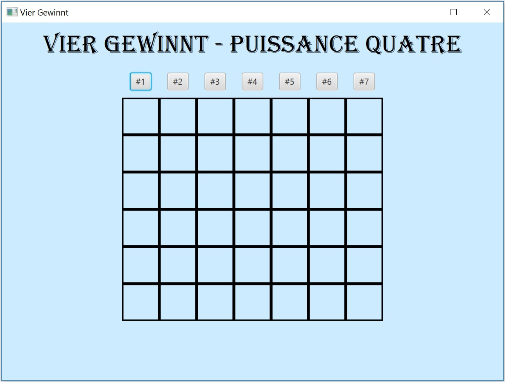

# Projekt VierGewinnt:

Java/Software Engineering Project VierGewinnt

Mitglieder: Tamara Lodico, Killian Valloton,Yannis Schmidt, Carl Podevjin

### Inhaltsverzeichnis

1. [Einleitung](#einleitung)
1. [Ziele](#ziele)
1. [Randbedingungen](#randbedingungen)
1. [Build-Anleitung](#buil-anleitung)
1. [Kurze Bedienungsanleitung](#kurze-bedienungsanleitung)
1. [User Stories](#user-stories)
1. [Releaseplan](#releaseplan)
1. [Dokumentation Sprint 1](#dokumentation-sprint-1)
    + [Taskliste für die Umsetzung der User Stories](#taskliste-für-die-umsetzung-der-user-stories)
    + [Anreicherung der User Stories für die Umsetzung](#anreicherung-der-user-stories-für-die-Umsetzung)
    + [Klassendiagramme](#klassendiagramme)
    + [Dokumentation wichtiger Code Snippets](#dokumentation-wichtiger-code-snippets)
    + [Testfaelle in Bezug auf Akzeptanzkritierium](#testfaelle-in-bezug-auf-akzeptanzkritierium)
    
1. [Dokumentation Sprint 2](#dokumentation-sprint-2)
    + [Taskliste für die Umsetzung der User Stories](#taskliste-für-die-umsetzung-der-user-stories)
    + [Anreicherung der User Stories für die Umsetzung](#anreicherung-der-user-stories-für-die-Umsetzung)
    + [Klassendiagramme](#klassendiagramme)
    + [Dokumentation wichtiger Code Snippets](#dokumentation-wichtiger-code-snippets)
    + [Testfaelle in Bezug auf Akzeptanzkritierium](#testfaelle-in-bezug-auf-akzeptanzkritierium)
    

## Einleitung 

Das folgende Git- Repository ist im Rahmen einer Gruppenarbeit in den Kursen Software Engieering und Programmieren II (Java) entstanden.
Die Aufgabenstellung formuliert das Erstellen eines Java Programms, welches auf dem Desktop eines Computers laufen kann. Nach reichlicher Überlegung haben wir uns für ein selbst erstelltes Spiel entschieden, um genauer zu sein soll es sich um ein Vier Gewinnt handeln.

## Ziele

Das Ziel ist es die erlernten Fähigkeiten und Kompetenzen im Bereich Programmieren und Software Engineering innerhalb eines einzig Projektes zu in Verbindung zu bringen. Hierfür wollen wir das Spiel Vier Gewinnt programmieren. Auf einer graphischen Oberfläche soll unser Hauptprogramm (Das Spiel) originalgetreu dargestellt werden und unserer Spiel darauf gespielt werden. Wir planen für dieses Projekt 2 Sprints.

## Randbedingungen

Das Programm soll in Java gelöst sein, hierfür sollen folgende Elemente zur Benutzung beachtet werden:

Java: JDK 8.0 
Eclipse EE
Build-Automatisierung: Maven

Der Aufwand des Projekts soll pro Student höchstens 10 Stunden sein

## Buil-Anleitung

Laden Sie sich die Datei xyz.jar auf ihren Pc runter. Und führen Sie sie aus.

## Kurze Bedienungsanleitung

Zum Starten der Uhr drücken Sie bitte auf Start. Sie können die Uhr mittels Stop anhalten. Unter Einstellungen können Sie die Farben und die Schriftgröße ändern.  
Nach dem Starten der . Datei erscheint die Oberfläche unseres Vier Gewinnt Spiels. Sie werden erkennen, dass das Spiel in 6 Reihen und 7 Spalten aufgebaut ist. Die typischen Regeln eines Vier Gewinnt Spiels sind folgende: Das Spiel wird im eins gegen eins Modus gespielt. Jeder Spieler bekommt eine Farbe von Spielsteinen, mit denen er versuchen soll eine Reihe von 4 Spielsteinen hintereinander seiner Farbe zu bekommen. Dies kann horizontal, vertikal oder auch diagonal erreicht werden. Sobald der Spieler eine solche Viererreihe erreicht hat er gewonnen und das Spiel kann erneut gestartet werden. 

## User Stories

## Releaseplan

## Dokumentation Sprint 1

#### Taskliste der User Stories

#### UML Klassen- und Sequenzdiagramme

Das Klassendiagramm:

Für das Klassendiagramm haben wir am Anfang 2 Klassen. Eine Mainklasse in der unser Programm enthalten ist, sowie eine Klasse in der unsere Oberfläche enthalten ist.
zum Speichern der Positon des Fensters und eine die die Oberfläche bildet. 

#### Dokumentation wichtiger Code Snippets
Unser Mainprogram: 

Inklusive des erstellen der Buttons:

#### Testfaelle bedingt durch Akzeptanzkritierium
## Dokumentation Sprint 2
#### Taskliste der User Stories
