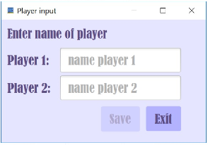

# Projekt VierGewinnt:

Programmieren II / Software Engineering Projekt VierGewinnt

Mitglieder: Tamara Lodico, Killian Valloton, Yannis Schmidt, Carl Podevjin

### Inhaltsverzeichnis

1. [Einleitung](#einleitung)
1. [Ziele](#ziele)
1. [Randbedingungen](#randbedingungen)
1. [Build-Anleitung](#build-anleitung)
1. [Kurze Bedienungsanleitung](#kurze-bedienungsanleitung)
1. [Userstories](#userstories)
1. [Releaseplan](#releaseplan)
1. [Dokumentation Sprint 1](#dokumentation-sprint-1)
    + [Taskliste für die Umsetzung der Userstories](#taskliste-für-die-umsetzung-der-userstories)
    + [Dokumentation wichtiger Code Snippets](#dokumentation-wichtiger-code-snippets)
    + [Ergebnisse nach Umsetzung der Userstories](#ergebnisse-nach-umsetzung-der-userstories)
    + [Testfaelle in Bezug auf Akzeptanzkritierium](#testfaelle-in-bezug-auf-akzeptanzkritierium)
    
1. [Dokumentation Sprint 2](#dokumentation-sprint-2)
    + [Taskliste für die Umsetzung der Userstories](#taskliste-für-die-umsetzung-der-userstories)
    + [Klassendiagramm](#klassendiagramm)
    + [Dokumentation wichtiger Code Snippets](#dokumentation-wichtiger-code-snippets)
    + [Ergebnisse nach Umsetzung der Userstories](#ergebnisse-nach-umsetzung-der-userstories)
    + [Testfaelle in Bezug auf Akzeptanzkritierium](#testfaelle-in-bezug-auf-akzeptanzkritierium)
    

## Einleitung 

Das folgende Git- Repository ist im Rahmen einer Gruppenarbeit in den Kursen Software Engineering und Programmieren II (Java) entstanden.
Die Aufgabenstellung formuliert das Erstellen eines Java Programms, welches auf dem Desktop eines Computers laufen kann. Nach reichlicher Überlegung haben wir uns für ein selbst erstelltes Spiel entschieden, um genauer zu sein soll es sich um ein Vier Gewinnt handeln.

## Ziele

Das Ziel ist es die erlernten Fähigkeiten und Kompetenzen im Bereich Programmieren und Software Engineering innerhalb eines einzigen Projektes in Verbindung zu bringen. Hierfür wollen wir das Spiel Vier Gewinnt programmieren. Auf einer graphischen Oberfläche soll unser Hauptprogramm (Das Spiel) originalgetreu dargestellt werden und unser Spiel darauf gespielt werden. Wir planen für dieses Projekt 2 Sprints.

## Randbedingungen

Das Programm soll in Java gelöst sein, hierfür sollen folgende Elemente zur Benutzung beachtet werden:

Java: JDK 8.0 

Eclipse EE

Build-Automatisierung: Maven

Der Aufwand des Projekts soll pro Student höchstens 10 Stunden sein

## Build-Anleitung

Build Anleitung für alle Betriebssysteme

Datei von Github VierGewinnt Projekt herunterladen.

Im gewüschten Ordner entpacken.

Den Pfad der gewünschten Versionsdatei (.jar) kopieren.

Die Eingabeaufforderung (Konsole) öffnen.

java -jar in die Eingabeaufforderung eingeben gefolgt von dem kopiertem Pfad der .jar datei. Mit Enter bestätigen.x
Beispiel:

java -jar C:\Users\Max Mustermann\Download\VierGewinnt\puissanceQuatre.jar

Besonders für Windows Betriebssystem - Erstellen eines Desktop Icons zum Starten des Programms durch Doppelklick.

Den Pfad der gewünschten Versionsdatei (.jar) kopieren.

Auf dem Desktop mit Rechtsklick eine neue Verknüpfung erstellen.

Den Pfad zuvor kopierten Pfad dort eingeben.

Die Verknüpfung benennen mit OK bestätigen.

Die Eigenschaften der Verknüpfung aufrufen dort im Reiter "Verknüfung" "Anderes Symbol..." auswählen dort Symbol auswählen und mit OK bestätigen

Im Reiter "Allgemein" die Option "öffnen mit" ändern auf "Java(TM) Platform..." und mit ok bestätigen.

## Kurze Bedienungsanleitung

Nach dem Starten der . Datei erscheint die Oberfläche unseres Vier Gewinnt Spiels. Sie werden erkennen, dass das Spiel in 6 Reihen und 7 Spalten aufgebaut ist. Die typischen Regeln eines Vier Gewinnt Spiels sind folgende: Das Spiel wird im eins gegen eins Modus gespielt. Jeder Spieler bekommt eine Farbe von Spielsteinen, mit denen er versuchen soll, eine Reihe von 4 Spielsteinen hintereinander seiner Farbe zu bekommen. Dies kann horizontal, vertikal oder auch diagonal erreicht werden. Sobald der Spieler eine solche Viererreihe erreicht, hat er gewonnen und das Spiel kann erneut gestartet werden. Die Bedienung des Spiels funktionniert mittels Mausklick aber auch mittels Tasteneingaben. 

## Userstories
| **Userstory Nr.** |   **Userstories / Akzeptanzkriterien**  | **Storypoints**  |  **Priorität** |
|:-:|-----|:-:|:-:|
| 1  | Als Benutzer möchte ich eine Spalte auswählen um einen Spielstein zu platzieren. AK: Wahl zwischen 7 Spalten durch Buttons | 8 | 1 |
| 2  |   Als Benutzer möchte ich das Spiel neustarten und verlassen können. AK: Neustart und Exit durch Buttons  | 2 | 2 |
| 3  |   Als Benutzer möchte ich die Namen für die 2 Spieler eingeben können. AK: Texteingabefeld welches bei jedem Start/Neustart erscheint und in den Namen vom Spieler 1 und 2 hintereinander abfragt  | 5 | 3 |
|  4 |  Als Benutzer möchte ich angezeigt bekommen sobald ich gewonnen habe. AK: Öffnen eines neuen Fensters welches den Gewinner anzeigt | 5 | 2  |
|  5 |  Als Benutzer möchte ich angezeigt bekommen welcher Spieler am Zug ist.  AK: Farbwechsel des Schriftzugs für den Spieler der am Zug ist  |  3 |  2 |
| 6  |  Als Programmierer möchte ich das Programm einfach nachvollziehen können um es nachbauen, warten und neue Features einfügen zu können. AK: Kommentare im Code. Logische Struktur (Klassen, Methoden, Variablen)  |  3 | 1  |

Legende : AK = Akzeptanzkriterium
## Releaseplan
|  Release 1 | Release 2  |
|:-:|:-:|
|  US 1 | US 2  |
|  US 4 | US 6  |
|  US 5 | US 3  |

Legende : US = Userstory

## Dokumentation Sprint 1
#### Taskliste für die Umsetzung der Userstories
| Tasknummer | Tasks | Userstory | Geschätzter Aufwand |
|:-:|-----|:-:|:-:|
| 1 | Grafisches Layout erstellen | 1 | 6 Stunden |
| 2 | Reihen und Spalten zum Spiel erstellen | 1 | 2 Stunden |
| 3 | 7 Buttons hinzufügen, die zu den zugehörigen Spalten gehören | 1 | 45 Minuten |
| 4 | Das Setzen von Spielsteinen an der richtigen Stelle ermöglichen | 1 | 4,5 Stunden |
| 5 | Das Setzen von Spielsteinen abwechselnd ermöglichen | 1 | 30 Minuten |
| 6 | Methode zum Suchen nach Gewinner erstellen (vertikal, horizontal und diagonal) | 4 | 3 Stunden |
| 7 | Abwechselnd die Schrift des aktiven Spielers mit einer für ihn vordefinierte Farbe darstellen | 5 | 1,5 Stunden |
| 8 | Neues Fenster erstellen, welches sich nach einem Sieg öffnet | 4 | 1 Stunde |
| 9 | Namen des Gewinners im Fenster anzeigen | 4 | 20 Minuten |
| 10 | Neues Fenster erstellen, welches sich bei einem Unentschieden öffnet | 4 | 45 Minuten |
| 11 | Button auf inaktiv stellen sobald die zugehörige Spalte voll ist | 1 | 30 Minuten |
| 12 | Inbetriebnahme aller setOnAction (Mouse,Taste) | 1 | 4 Stunden |

#### Dokumentation wichtiger Code Snippets
Erstellen des Gitters und füllen mit ausgeblendeten Punkten :

Erstellen der Buttons mit einem Exemplar des setOnAction (mit Maus und Taste):

Methode um den Spieler zu wechseln :

Öffnen eines neuen Fensters um den Gewinner zu definieren :

#### Ergebnisse nach Umsetzung der Userstories

Nach dem ersten Sprint haben wir folgendes Ergebnis für unsere Spieloberfläche:

#### Testfaelle in Bezug auf Akzeptanzkritierium
| Testfall | Aus US/AK | Vorbedingung | Ablauf | Resultat |
|:-:|:-:|-----|-----|-----|
| 1 | 1 | Das Spiel wurde gestartet und die Oberfläche ist bereit | Klicke auf beliebigen Knopf zwischen 1-7 | Der Spielstein erscheint an der untersten Stelle der gewählten Reihe |
| 2 | 4 | Der Spieler muss noch einen Stein setzen um zu gewinnen | Klicke auf den notwendigen Knopf um zu gewinnen | Der Spieler bekommt in einem neuen Fenster angezeigt, dass er gewonnen hat |
| 3 | 5 | Das Spiel wurde gestartet Nach jedem Wechsel des Spielers am Zug | Sobald ein Spieler am Zug ist | Der Spieler, der am Zug ist bekommt durch einen Farbwechsel auf seinen Namen angezeigt, dass er an der Reihe ist |
## Dokumentation Sprint 2

#### Taskliste für die Umsetzung der Userstories
| Tasknumme | Tasks | Userstory | Geschätzter Aufwand |
|:-:|-----|:-:|:-:|
| 1 | Exit Button erstellen und mit Exit-Methode verknüpfen | 2 | 30 Minuten |
| 2 | Neustart Button erstellen und mit Neustart-Methode verknüpfen | 2 | 50 Minuten ||
| 4 | Textfeld in Fenster einfügen um die 2 Namen hintereinander einzugeben | 3 | 1,5 Stunden |
| 6 | Klassendiagramm auf Eclipse erstellen  | 6 | 20 Minuten |
| 7 | Dokumentation im MarkDown Format in der README Datei schreiben (Projektbeschreibung) | 6 | 5 Stunden |
| 8 | Dokumentation im MarkDown Format in der README Datei schreiben (Sprint 1) | 6 | 4 Stunden |
| 9 | Dokumentation im MarkDown Format in der README Datei schreiben (Sprint 2) | 6 | 4 Stunden |
| 10 | Kommentare zum Programm hinzufügen | 6 | 1 Stunde |
| 11 | Testklassen schreiben (JUnit) | 6 | 1,5 Stunden |
| 11 | Designen der gesamten Oberfläche | 6 | 3 Stunden |

#### Klassendiagramm

Das Klassendiagramm:

Für das Klassendiagramm haben wir  2 Klassen. Eine Mainklasse ("LogicModule") in der unser Hauptprogramm enthalten ist sowie eine Layout Klasse ("MainApp") in der unsere Oberfläche enthalten ist.

#### Dokumentation wichtiger Code Snippets
Code um eine Gewinnerlinie zu finden:

Save button zum Speichern der Spielernamen (setOnAction mit Mause und Taste)

JUnit Test: Erkennt ob es ein Gewinner gibt

#### Ergebnisse nach Umsetzung der Userstories

Nach dem zweiten Sprint haben wir folgendes Ergebnis für unsere Spieloberfläche:

- Eine Spielereingabe, die sich nach jedem Start/Neustart öffnet:

    

- Die Oberfläche unseres Spiels mit platzierten Steinen:

- Das geöffnete Fenster sobald ein Spieler gewonnen hat.

#### Testfaelle in Bezug auf Akzeptanzkritierium
| Testfall | Aus US/AK | Vorbedingung | Ablauf | Resultat |
|:-:|:-:|-----|-----|-----|
| 1 | 2 | Das Programm wurde gestartet | Klicke auf den Knopf „New Game“ Klicke auf den Knopf „Exit“ | Das Spiel wird neugestartet Das Spiel wird beendet |
| 2 | 6 | Das Programm soll durch Features verbessert werden | Programmiere den zu hinzufügenden Teil | Das Spiel läuft ohne Probleme mit den neuen Features |
| 3 | 3 | Das Spiel wurde gestartet Das Spiel wurde neugestartet | Trage die Namen der 2 Spieler in die Textfelder ein und drücke auf den Knopf „Save“  | Die Namen werden während dieses Spiels angezeigt  |
